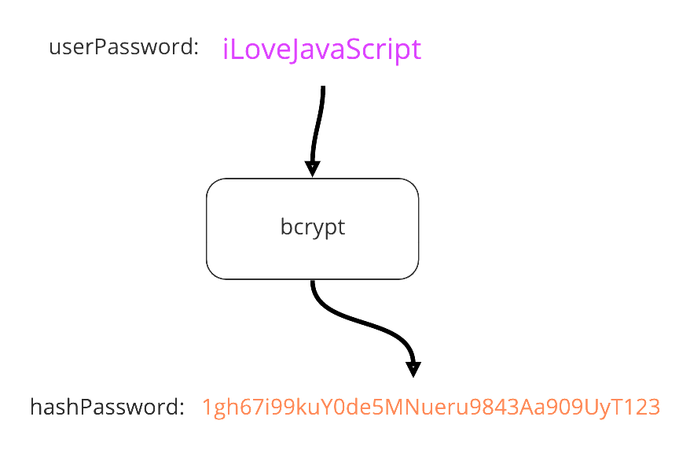

# Signup, Login and Roles

- Authentication: ?
- Authorization: ?

## Signup

- Email and password
- Username and password
- Combination of previous two
- Social network login

## Hashing


- deterministic 
- fixed length 
- small change in input results in a completely different hash
- **cannot be decrypted back to its original input**

We will use the npm bcrypt package to hash our passwords  
https://bcrypt-generator.com  



### Salt

- we will add a random salt to the hash to make it resistant against brute-force attacks
- the salt is part of the string


```
<any digital input> => "$2b$10$b/0PX8UUYwzY20sxfJYzu.IAWTqCHcbh1EHJdr0keknqk1fKhOVHC"
```

## Create the app

Install needed packages:  
```bash
$ npx ironlauncher@latest node-basic-auth
$ npm install bcryptjs express-session connect-mongo 
```

We need to add a .env-file. It contains the MongoDB-URL and the express-session-secret:
```
PORT=3000
MONGODB_URI=<URL to MongoDB>
SECRET=<session secret>
```